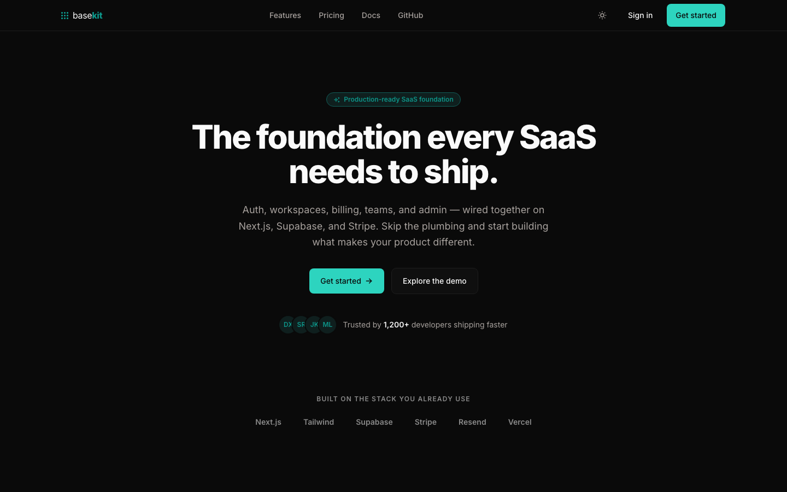
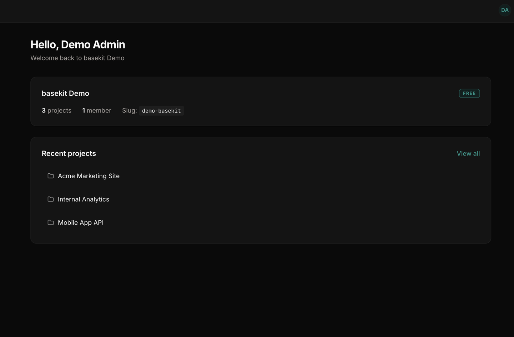
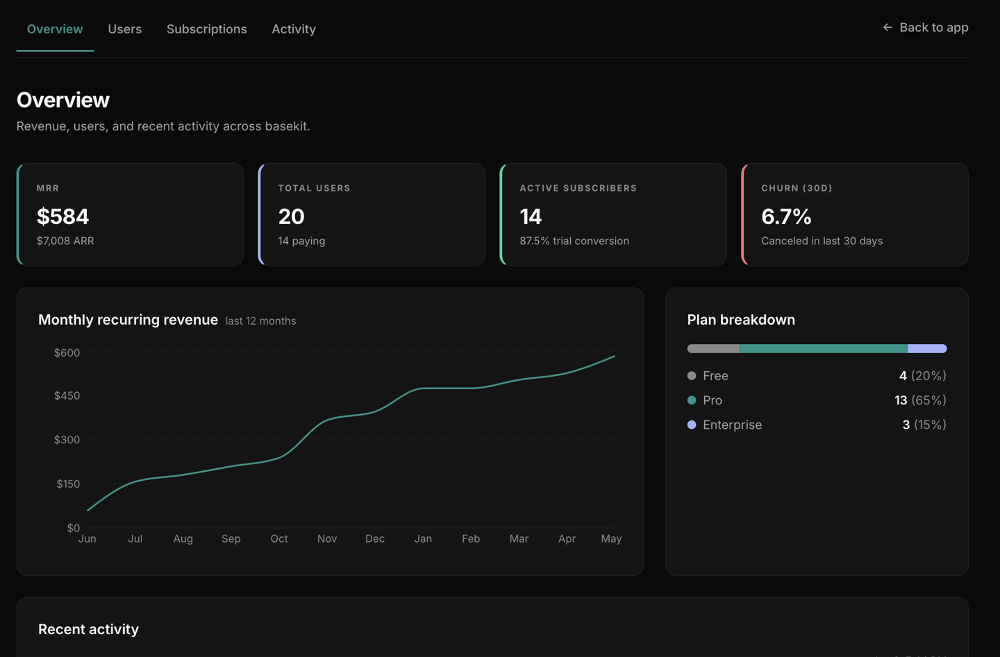
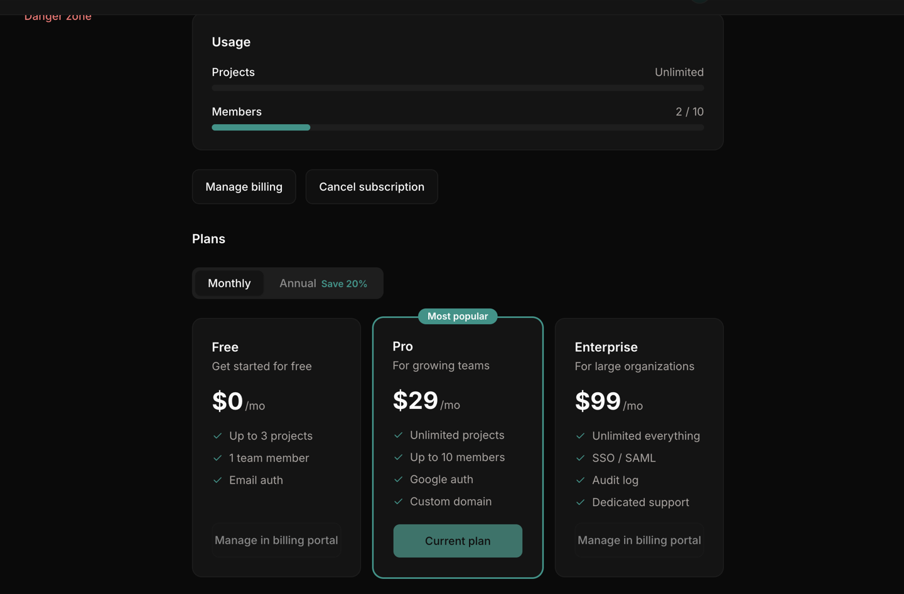

# basekit

**The foundation every SaaS needs to ship.**

A production-ready, multi-tenant SaaS starter — auth, workspaces, Stripe billing, teams, admin tooling, and transactional email, wired end to end. Sign up, hit a plan limit, upgrade through Stripe, invite a teammate, cancel — the full lifecycle works, in production.

🔗 **Live demo → [basekit.rickycodes.dev](https://basekit.rickycodes.dev)** — click **"Explore the demo"** for a one-click, pre-seeded **admin** tour. No signup.

`Next.js 15` · `React 19` · `TypeScript (strict)` · `Supabase` · `Stripe` · `Tailwind 4` · `Vitest`

---

## Screenshots

| Landing | Dashboard |
|---|---|
|  |  |

| Admin — MRR & metrics | Billing & plan management |
|---|---|
|  |  |

---

## Overview

Most of a SaaS is plumbing — the same hard problems every product re-solves before it can build anything unique: **multi-tenant data isolation**, the **billing lifecycle**, **team management**, **admin/operations tooling**, and **transactional email** — all of it type-safe, tested, and secure. basekit is that plumbing, built to a production bar so you can skip it and ship the thing that makes your product different.

Two problems drove the architecture:

- **Tenant isolation that can't be bypassed.** Authorization lives in the database (Postgres Row-Level Security), not in app code — so a missing `where` clause can't leak another tenant's data. Verified by a two-account integration test against the live RLS engine (14/14).
- **A billing lifecycle that survives the real world.** Stripe webhooks retry, arrive out of order, and double-deliver. Plan state is derived from signature-verified, idempotent webhook handling backed by a `stripe_events` ledger — never from the client.

---

## Tech stack

**Core**
| Tool | Role |
|------|------|
| Next.js 15 (App Router) | Server Components + Server Actions; server-first data |
| React 19 · TypeScript 5 | `strict` mode, no `any`, branded ID types |
| Tailwind CSS 4 · shadcn/ui · next-themes | Design system + full light/dark theming |

**Data & auth**
| Tool | Role |
|------|------|
| Supabase (Postgres + Auth + Storage) | Database, email/OAuth auth, file storage |
| Row-Level Security | The authorization layer — RLS on every user-facing table |
| Zod | Input validation on every route handler, Server Action, and webhook |

**Billing, email & infra**
| Tool | Role |
|------|------|
| Stripe (Checkout · Customer Portal · Webhooks) | PCI-scoped checkout, dunning, self-serve plan management |
| Resend + React Email | Six type-safe transactional templates (multipart text + HTML) |
| Upstash (Ratelimit + Redis) | Sliding-window rate limiting on every sensitive surface |
| Sentry · Vercel | Error tracking (webhooks + API) · hosting on a custom domain |

**Testing & quality**
| Tool | Role |
|------|------|
| Vitest · React Testing Library · jsdom | Unit + component + integration tests |
| v8 coverage · GitHub Actions | Enforced coverage gate; type-check / test / build in CI |

---

## How it works

### Multi-tenant auth & workspaces
Email/password + Google OAuth (Supabase Auth); a new account is bootstrapped into its own workspace. Every table carries a Row-Level Security policy keyed to workspace membership, so the database — not the app — decides what a request can read or write.

### Billing lifecycle
| Step | What happens |
|------|--------------|
| Upgrade | `/api/billing/checkout` creates a Stripe Checkout session (rejects already-subscribed workspaces) |
| Webhook | Signature-verified events are deduped against a `stripe_events` table, then derive `plan_name`/`status` |
| Enforcement | `canCreateProject` / `canAddMember` gate features by plan; fail **open** on a DB error (+ Sentry) |
| Manage | The Stripe Customer Portal owns cancellation, plan switches, and payment methods |

Webhook handlers always return `200` (even on failure — logged to Sentry) so Stripe never enters a retry storm.

### Admin & impersonation
A role-gated admin section: MRR / churn / plan metrics with a 12-month revenue chart, user + subscription search/filter, audited plan overrides, and an activity log. **Impersonation** swaps the effective identity to a target user (read-observational) via a signed, httpOnly, 30-minute cookie — every start/end is written to the audit log with the real admin's id.

### One-click demo
"Explore the demo" signs into a shared, pre-seeded **admin** account so the full product (including admin) is visible with zero friction. Because that account shares the database with real data, destructive writes are blocked server-side and **every admin read is scoped to demo data only**; a nightly GitHub Actions job re-seeds it.

---

## Architecture

**RLS is the authorization layer.** App code never filters by `user_id` "to be safe" — that masks policy bugs. Postgres enforces isolation; a reproducible two-account script drives the live RLS engine with real JWTs (14/14 pass).

**The service-role key never reaches the client.** It lives behind a server-only factory called only from route handlers and Server Actions. Anything client-reachable goes through RLS.

**One error shape, everywhere.** Every fallible lib function, route, and action returns `ApiResult<T>` (`{ ok: true, data } | { ok: false, error }`). No throwing across boundaries, no `null`-means-error, no raw vendor errors leaking to the client.

**Optimistic UI with automatic rollback.** Mutations update instantly via `useOptimistic` + `useTransition`; a failed Server Action rolls the UI back and surfaces a toast.

**Rate-limited at every surface.** Upstash sliding-window limiters cover login, signup, password reset, all billing/team/admin write routes, and the Stripe webhook.

**Server-first by default.** Data lives in Server Components; client components appear only where interactivity demands. First-load JS is dynamically split (charts, Stripe.js) and the shared bundle trimmed (error-only Sentry).

---

## Features

- Email/password + Google OAuth, email verification, per-user workspace bootstrap
- Multi-tenant workspaces with database-enforced (RLS) isolation
- Stripe Checkout + Customer Portal; plan derivation from price IDs; per-plan usage limits + upgrade prompts
- Signature-verified, idempotent Stripe webhook engine
- Team invitations (single-use token carried through signup), role management, member-limit re-gating at accept time
- Admin dashboard: MRR/churn/plan metrics + 12-month chart, user/subscription search, audited plan overrides, activity log
- Read-observational impersonation with a signed cookie + full audit trail
- Six transactional emails (React Email) with per-user notification preferences and opt-out
- Full dark mode, responsive (mobile bottom nav), SEO (sitemap/robots/OG image), WCAG-AA contrast, one-click demo

---

## Testing & quality

Tests are part of the definition of done — written alongside each module, never deferred.

- **652 tests** across three layers: unit (`lib/`), component (React Testing Library), integration (route handlers with mocked Stripe/Supabase/Resend).
- **Coverage gate enforced in CI** at 85 / 85 / 80 / 85 (statements / functions / branches / lines) — currently **90.5% lines**.
- **RLS verified** against the live database (14/14) via a self-cleaning two-account script.
- **Lighthouse (production):** landing **96 / 100 / 100 / 100**, dashboard **100 / 100** (Perf / A11y / Best Practices / SEO).

```bash
npm run type-check   # tsc --noEmit, zero errors
npm test             # vitest run
npm run test:coverage
npm run build
```

---

## Getting started

```bash
# 1. install
git clone https://github.com/ricky-antonio/basekit.git && cd basekit
npm install

# 2. configure — copy the contract and fill in values
cp .env.example .env.local

# 3. run
npm run dev   # http://localhost:3000
```

Requires accounts for **Supabase**, **Stripe**, **Resend**, and **Upstash**. The `.env.example` file is the full contract:

```
NEXT_PUBLIC_SUPABASE_URL · NEXT_PUBLIC_SUPABASE_ANON_KEY · SUPABASE_SERVICE_ROLE_KEY
STRIPE_SECRET_KEY · STRIPE_WEBHOOK_SECRET · STRIPE_PRICE_* (pro/enterprise × monthly/annual)
RESEND_API_KEY · FROM_EMAIL · UPSTASH_REDIS_REST_URL · UPSTASH_REDIS_REST_TOKEN
SENTRY_DSN · NEXT_PUBLIC_SITE_URL
```

| Script | Purpose |
|--------|---------|
| `npm run dev` | Local dev server |
| `npm run build` / `start` | Production build / serve |
| `npm run type-check` | `tsc --noEmit` |
| `npm test` / `test:coverage` | Vitest (with v8 coverage) |
| `npm run email` | React Email preview on :3001 |

---

## Project structure

```
basekit/
├── app/
│   ├── (marketing)/        # public landing + pricing
│   ├── (auth)/             # login · signup · reset · OAuth callback
│   ├── (app)/              # authenticated shell: dashboard · projects · team · settings
│   ├── (admin)/            # metrics · users · subscriptions · activity · impersonation
│   ├── api/                # route handlers: billing · team · admin · webhooks
│   ├── icon.svg            # brand favicon (3×3 grid)
│   └── opengraph-image.tsx # build-generated OG image
├── components/             # admin · auth · billing · dashboard · email · layout · marketing · team · ui
├── lib/                    # 29 domain modules (auth, subscription, billing, team, admin, email, …)
│   ├── supabase/           # server · client · middleware clients
│   └── validation/         # Zod schemas per domain
├── tests/                  # unit + component + integration; shared service mocks
├── supabase/migrations/    # combined.sql — schema, RLS policies, grants, functions
├── scripts/                # seed-demo · rls-verify · set-plan
└── .github/workflows/      # CI (type-check/test/build) + nightly demo reset
```

---

Built by [Ricardo Monterrosa](https://github.com/ricky-antonio). Live at **[basekit.rickycodes.dev](https://basekit.rickycodes.dev)**.
